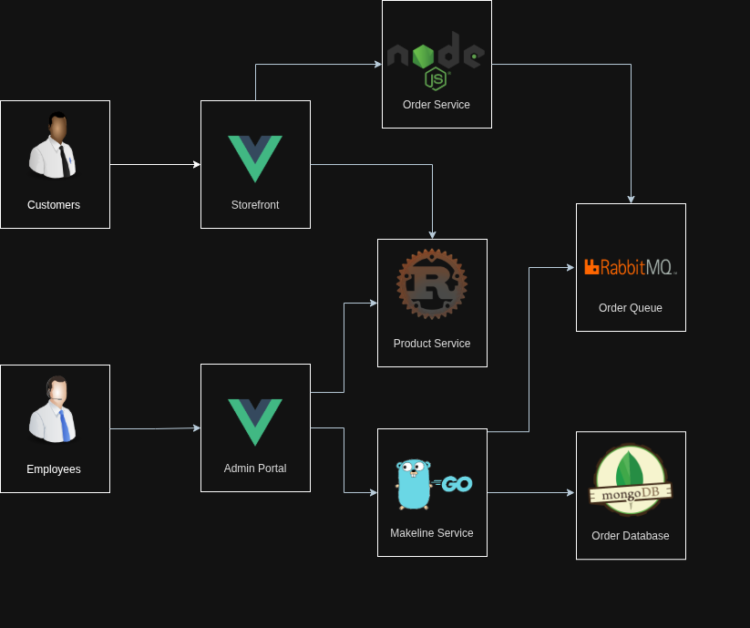

# CST8915 Final Project: Cloud-Native App for Best Buy

[Link to video demo](https://youtu.be/oAaQmsPn1eM)

## Architecture Diagram



## Application Explanation

This project is a Best Buy–style e-commerce platform built using a
microservices architecture. It demonstrates how a large retail system can be
composed of independent, scalable services. The application is fully
containerized and deployed on Kubernetes, with GitHub Actions handling
end-to-end CI/CD automation.

- **store-front:** The customer-facing web application that displays products,
  manages the shopping cart, and submits orders.
- **store-admin:** An administrative portal used for managing product data,
  inventory updates, and order monitoring.
- **product-service:** A backend service that provides product information to
  both the storefront and admin portal.
- **order-service:** Processes incoming customer orders from the frontend,
  validates product availability, and forwards order events into the system.
- **makeline-service:** Listens to the order queue, handles fulfillment workflow,
  and allows employees to mark orders as shipped.

## Deployment Instructions

1. Provision an AKS cluster on Azure.

2. Authenticate with the cluster

Use Azure CLI to pull the cluster credentials into your local kubeconfig:

```bash
az aks get-credentials --resource-group <your-resource-group> --name <your-aks-cluster-name>
```

3. Deploy Resources

Apply the provided Kubernetes manifest to deploy all application components:

```bash
kubectl apply -f bb-all-in-one.yaml
```

4. Verify Deployment

Confirm that pods and services are running:

```bash
kubectl get pods
kubectl get services
```

## Repos

### GitHub

- [store-front](https://github.com/DunneDev/store-front-BB)
- [store-admin](https://github.com/DunneDev/store-admin-BB)
- [product-service](https://github.com/DunneDev/product-service-BB)
- [order-service](https://github.com/DunneDev/order-service-BB)
- [makeline-service](https://github.com/DunneDev/makeline-service-BB)

### Docker Hub

- [store-front](https://hub.docker.com/repository/docker/sdunne828/store-front-bb/general)
- [store-admin](https://hub.docker.com/repository/docker/sdunne828/store-admin-bb/general)
- [product-service](https://hub.docker.com/repository/docker/sdunne828/product-service-bb/general)
- [order-service](https://hub.docker.com/repository/docker/sdunne828/order-service-bb/general)
- [makeline-service](https://hub.docker.com/repository/docker/sdunne828/makeline-service-bb/general)
